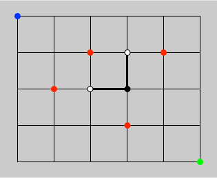

# Grid Paths

Suppose we have a traveller who wants to move between two points in a rectangular grid with M rows and N columns, such that he can only move to the right or downwards. Moreover, suppose that there are certain points on the grid which he wants to avoid altogether. What is the number of possible paths, given the size of the grid and the number and locations of the points to avoid? For example, in the figure below, suppose he starts at the blue dot and wants to arrive at the green dot avoiding all the red dots.

Originally written on August 2, 2015.

## Creator

That would be me, _Wagner Truppel_. If you need or want to contact me, send a message to `wagner` at `restlessbrain` dot com.

## License

I'm sharing this work under the [Creative Commons Attribution-ShareAlike 4.0 International (CC BY-SA 4.0)](http://creativecommons.org/licenses/by-sa/4.0/) license. See the LICENSE file for more information.
